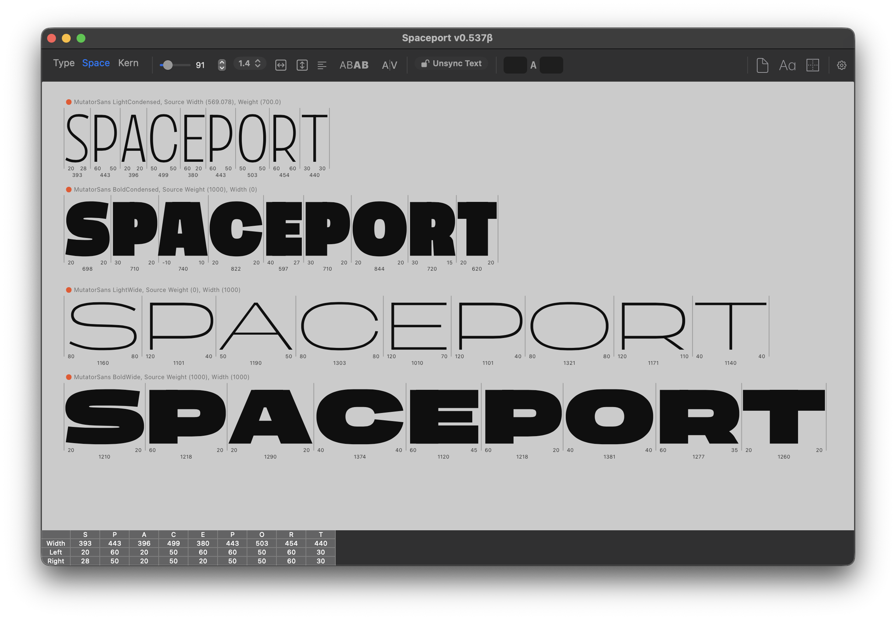
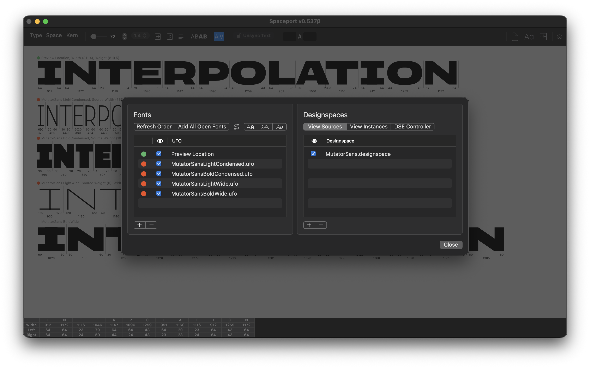

<!-- 

 -->
# Spaceport

>"A spaceport is a site where spacecraft are tested, launched, sheltered and maintained.
The Spaceport extension is a place where multiple, unrelated UFOs can be spaced, kerned and interpolated concurrently."

##### Spaceport is currently in beta development.

## User Interface - Main Window

- 1 : State Toggler
	- Type: Typing state, enter text and edit strings
	- Space: Edit spacing
	- Kern: Edit Kerning

- 2 : Point Size
 
- 3 : Line Height
 
- 4 : Fit Text
	- To Width
	- To Height
 
- 5 : Text Alignment
 
- 6 : Character Ordering
 
- 7 : (Un)sync Text Strings
 
- 8 : Leading and Trailing Text Field
 
- 9 : Controllers
	- Objects Controller:
		- Add and manage UFOs and Designspaces
 	- OpenType Features Controller
 	- Interpolation Controller

- 10 : Settings Window
 
- 11 : Space Matrix

## Key Controls

### Spacing

Arrow Keys: `← → ↓ ↑`
Spaceport allows you to modify glyph(s) spacing via the arrow keys, optionally with modifiers to change the increments.
With at least one selected item, you can edit the spacing. If more than one item is selected, it will apply the delta globally to those glyphs.

`shift + command = 100` 
`shift = 10`
`default = 1`

`up` and `down` arrows control the glyphs' width, adding or subtracting the delta, respectively.

`left` and `right` arrow controls the glyphs' margins, if `option` is pressed, the `leftMargin` will be edited. `right` arrow will add the delta, while `left` will subtract the delta.

### Other Events

`command z` Call and apply the selected glyphs' undo manager stack

`command t` Toggle between _Typing_ and _Spacing_ modes

`command ;` Open objects manager sheet

`command +` Zoom in

`command -` Zoom out
                    
`b` Toggle beam visibility

`m` Toggle metrics visibility

`l` Toggle label visibility

`l` Toggle apply kerning

##### The following keys are extracted from the users' preferences

`glyphViewZoomInKey` Zoom in `e.g. z`

`glyphViewZoomInKey` Zoom out `e.g. x`

## Typing

## Kerning

## Mouse Controls

When selecting a glyph inside the Spaceport view there are several modifiers available.

`shift` will allow for multi-glyph selection

`option` selects the current glyph in all fonts that are activated

_Note: `shift` and `option` are not able to be combined!_

Double clicking a single item will open a `DoodleGlyphWindow` for that glyph.

### Objects Manager

Tabs:  `Fonts`  `Designspaces`

#### `Fonts`

`Font List` A list with all fonts, can be (de)activated with checkbox

`Refresh Order` Update the font order (font list can be dragged to reorder)

`Add All Open Fonts` Add all open fonts to the font list

`Open Font Interface` Show fonts' interface when opening new font object

#### `Designspaces`

`Designspace List` A list with all designspaces, can be (de)activated with checkbox, but only one can be used a time

`View Sources` Add all designspace sources to the font list

`View Instances` Add all designspace instances to the font list (metrics can not be edited) (interpolation value can be edited)

`DSE Controller` Allow DesignspaceEditor to control the interpolation values, display selected instances, or selected sources

### Interpolation Controller

If there is an activated designspace, the interpolation controller will generate a UI to control all available axes in the operator. Discrete axes can be accessed through popup buttons while continuous axes can be controlled 2 at a time through an interactive 2-dimensional view.

Continuous axes can be switched using the x and/or y axes popovers and dragging your mouse within the view. The mouse location is remapped into the axes' minimum and maximum.

### Credits

Developed by Connor Davenport

Designed by Vincent Chan and Connor Davenport

Sponsored by Vincent Chan

